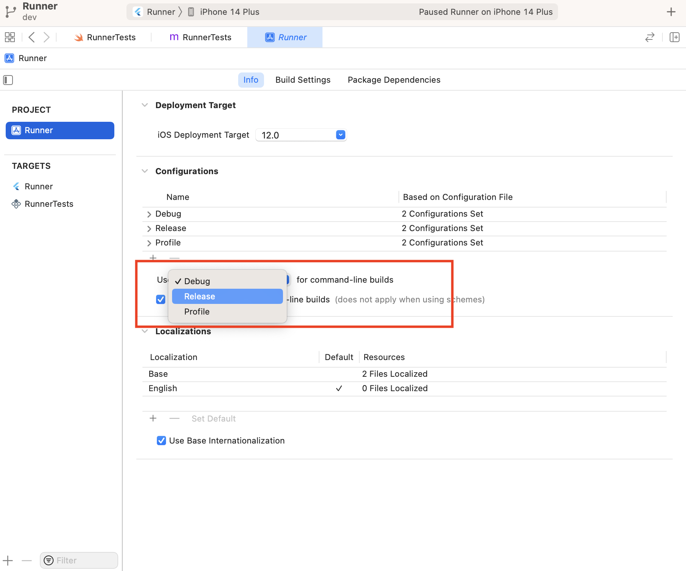

# flutter_native

Run your flutter integration tests on BrowserStack.
You can Refer to this [link](https://docs.flutter.dev/get-started/test-drive), if you are new to flutter

Check the pubspec.yaml file and make sure you have added those dependencies 

### Sample app
* A sample app code is present inside the lib folder so that you can test it. 
* You can run the app locally from the command line as follows:
  - `flutter run`

### Integration tests
* Integration tests are present inside the integration_test folder. `integration_test/app_test.dart`
* For running the test locally:
  - `flutter test integration_test/app_test.dart`

## To Prepare Android Flutter app and test suite for testing
1. Create an instrumentation test file in android/app/src/androidTest/java/com/example/flutter_native/MainActivityTest.java
2. Update flutter_native/android/app/build.gradle file to make sure it uses androidx's version of AndroidJUnitRunner and has androidx libraries as a dependency.
`android {
  ...
  defaultConfig {
  ...
  testInstrumentationRunner "androidx.test.runner.AndroidJUnitRunner"
  }
  }
  dependencies {
  testImplementation 'junit:junit:4.12'
  androidTestImplementation 'androidx.test:runner:1.2.0'
  androidTestImplementation 'androidx.test.espresso:espresso-core:3.2.0'
  }
  `
3. Use the following Gradle commands to build an instrumentation test.apk file(test suite) using the MainActivityTest.java created in the androidTest directory
   - `pushd android`
   - `flutter build apk`
   - `./gradlew app:assembleAndroidTest` If you encounter the error "gradle:compileGroovy FAILED," please refer to the resolution provided at the end of the Android section.
   - ``./gradlew app:assembleDebug -Ptarget=`pwd`/../integration_test/app_test.dart``
   - `popd`

### You can now find your files at the following locations:
- App APK: `build/app/outputs/apk/debug/app-debug.apk`
- Test Suite APK: `build/app/outputs/apk/androidTest/debug/app-debug-androidTest.apk`

### Running tests on BrowserStack
  - ##### upload apk
  ```
  curl -u "BROWSERSTACK_USERNAME:BROWSERSTACK_ACCESS_KEY" \
   -X POST "https://api-cloud.browserstack.com/app-automate/flutter-integration-tests/v2/android/app" \
   -F "file=@/path/to/app/file/Application-debug.apk"
   ```
  <sub>Note down the app_url from the response</sub>

  - ##### upload test apk
   ```
   curl -u "BROWSERSTACK_USERNAME:BROWSERSTACK_ACCESS_KEY" \
   -X POST "https://api-cloud.browserstack.com/app-automate/flutter-integration-tests/v2/android/test-suite" \
   -F "file=@/path/to/app/file/Application-debug-test.apk"
   ```
  <sub>Note down the test_suite_url from the response</sub>

  - #### run the tests
   ```
   curl -u "BROWSERSTACK_USERNAME:BROWSERSTACK_ACCESS_KEY" \
   -X POST "https://api-cloud.browserstack.com/app-automate/flutter-integration-tests/v2/android/build" \
   -d '{"app": "<APP_URL>", "testSuite": "<TEST_SUITE_URL>", "devices": ["Samsung Galaxy S21-12.0"]}' \
   -H "Content-Type: application/json"
   ```

### To resolve the "gradle:compileGroovy FAILED" error, follow these steps:
1. Run the following command to find your Java version:
  `java --version`
2. Visit this [link](https://docs.gradle.org/current/userguide/compatibility.html#java) and identify the Gradle version compatible with your Java version. For example, if your Java version is 22.0, the matching Gradle version is 8.8
3. Navigate to your project folder and locate the gradle-wrapper.properties file in:
   android/gradle/wrapper/gradle-wrapper.properties.
   Update the distributionUrl version:
   Current value: `distributionUrl=https://services.gradle.org/distributions/gradle-8.3-all.zip`
   Update to: `distributionUrl=https://services.gradle.org/distributions/gradle-8.8-all.zip`
4. Run your project again. Gradle will automatically download the updated version. 

## To Prepare iOS Flutter test package for testing
1. On Xcode, open `ios/Runner.xcworkspace` in your app’s iOS folder.
2. Ensure that the `iOS Deployment Target` setting in the Build Settings section for the RunnerTests file matches the setting in the Runner file.
3. Add a test file `RunnerTests.m` to a `RunnerTests` target file in Xcode. 
4. Execute the following commands:
   - `output="../build/ios_integration"`
   - `product="build/ios_integration/Build/Products"`
   - `flutter build ios integration_test/app_test.dart --release` If you encounter the error "module 'integration_test' not found" please refer to the resolution provided at the end of the IOS section.
   - `pushd ios`
   - `xcodebuild -workspace Runner.xcworkspace -scheme Runner -config Flutter/Release.xcconfig -derivedDataPath $output -sdk iphoneos build-for-testing` 
   - `popd`
   - `pushd $product`
   - `zip -r "com.khunsha.flutterNative.zip" "Release-iphoneos" "Runner_iphoneos16.4-arm64.xctestrun"` xctestrun file is present at the build output path build/ios_integration/Build/Products.
   - `popd`

### You can now find your zip file at the following location:
- zip file: `build/ios_integration/Build/Products/com.khunsha.flutterNative.zip`

### Running tests on BrowserStack
  - ##### upload test package
  ```
  curl -u "BROWSERSTACK_USERNAME:BROWSERSTACK_ACCESS_KEY" \
   -X POST "https://api-cloud.browserstack.com/app-automate/flutter-integration-tests/v2/android/app" \
   -F "file=@/path/to/your/ios/test/package.zip"
   ```
<sub>Note down the test_package_url from the response</sub>
   - #### run the tests
   ```
   curl -u "BROWSERSTACK_USERNAME:BROWSERSTACK_ACCESS_KEY" \
   -X POST "https://api-cloud.browserstack.com/app-automate/flutter-integration-tests/v2/android/build" \
   -d '{"devices": ["iPhone 14-18"], "testPackage":"<TEST_PACKAGE_URL>","networkLogs":"true","deviceLogs":"true"}' \
   -H "Content-Type: application/json"
   ```


### To resolve the "Module 'integration_test' Not Found" Error, follow these steps:

Follow these steps to resolve the issue:

1. **Set the Build Configuration to Release**
   - Open the Runner project in Xcode.
   - Select the `Release` configuration for command-line builds. Refer to the screenshot below:  
     

2. **Run the Following Commands** (if the above step does not resolve the issue):
   ```bash
   flutter pub get
   cd ios
   rm -rf Pods/ Podfile.lock
   pod install

### To resolve the Cocoapods Installation Issues on Apple Silicon, follow these steps:
- Run the following command:
   `sudo arch -x86_64 gem install ffi`
- Navigate to the ios folder and run:
   `arch -x86_64 pod install`